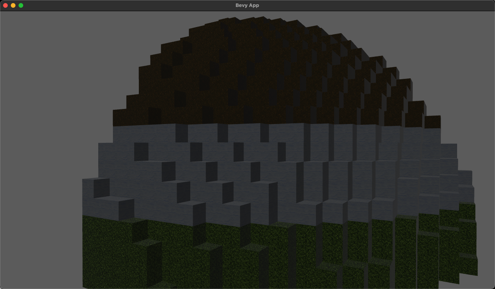

# Minecraft like mesh shader rendering Demo used block_mesh for Bevy.
 

Reference:
- [array_texture_demo](https://github.com/bevyengine/bevy/blob/release-0.10.1/examples/shader/array_texture.rs)
- [custom_vertex_attribute](https://github.com/bevyengine/bevy/blob/release-0.10.1/examples/shader/custom_vertex_attribute.rs)
- [vx_bevy](https://github.com/Game4all/vx_bevy)
- [block_mesh](https://github.com/bonsairobo/block-mesh-rs)